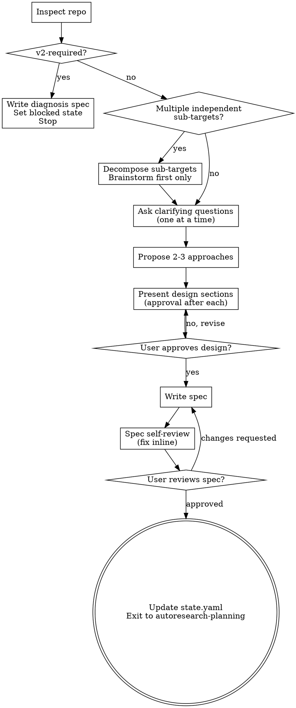

# Autoresearch Brainstorming

## Overview

Autoresearch brainstorming is structured diagnosis before commitment. It inspects a target research repo, determines whether it fits the V1 small-repo profile, and produces a written spec that freezes all profile inputs before any planning, bootstrapping, or experiment execution begins.

**Core principle:** Diagnose before touching. Freeze the profile contract before planning.

## When to Use

Use autoresearch brainstorming when:
- A small research training repo needs to be onboarded into an autoresearch experiment loop
- The compatibility of a repo with the V1 profile is unknown
- Profile fields (`runtime`, `experiment`, `edit_scope`, `baseline`, `git_policy`, `logging`) have not yet been determined
- No spec, profile, or plan exists yet for this repo

Do NOT use autoresearch brainstorming when:
- A spec is already written and approved (`profile_status: spec-frozen`)
- Planning or bootstrapping is already underway
- The repo has already been diagnosed as `v2-required` (blocked — see below)

## Checklist

You MUST create a task for each item and complete them in order:

1. **Inspect the repo** — read training entry point, config files, dependencies
2. **Classify the repo** — assign V1 diagnosis label (v1-direct-fit, v1-bootstrap-fit, v2-required)
3. **Scope decomposition check** — if multiple independent sub-targets, decompose first
4. **Ask clarifying questions** — one at a time, understand runtime/metric/edit_scope/git_policy
5. **Propose 2–3 approaches** — with trade-offs and recommendation
6. **Present design in sections** — get approval after each section before writing spec
7. **Write the spec** — save to `docs/autoresearch/specs/YYYY-MM-DD-<topic>-design.md`
8. **Spec self-review** — check all profile fields resolved, no TBDs, no contradictions
9. **Ask user to review spec** — provide file path only, do NOT summarize content
10. **Wait for approval** — if changes requested, revise and re-run spec review loop

## Process Flow



**The terminal state is updating state.yaml and exiting to autoresearch-planning.** Do NOT invoke any other skill. The ONLY skill you invoke after brainstorming is autoresearch-planning.

## The Process

### Step 1: Inspect the Repo

Before asking any questions, read the target repo thoroughly:
- Read the training entry point (e.g., `train.py`, `main.py`, `run.py`)
- Read any existing config files, `requirements.txt`, `pyproject.toml`, or `Makefile`
- Read repo documentation that explains setup, training flow, logging, or experiment conventions
- Check recent commits or other local history signals if available, especially when they clarify the current training entry path or intended workflow
- Check for distributed training markers (`torchrun`, `deepspeed`, `accelerate launch`, multi-node flags)
- Understand the training loop, optimizer, and metric logging

### Step 2: Classify the Repo (V1 Diagnosis)

Assign one of three compatibility labels:

- **`v1-direct-fit`**: Repo already matches V1 profile with minimal adaptation. Single-process training, clear entry command, single scalar metric logged to stdout or a log file, short run time (under 10 minutes per run), editable `train.py`-style file.

- **`v1-bootstrap-fit`**: Repo needs a thin compatibility layer, but the core training loop is still compatible with V1. Valid cases include: metric extraction needs a small wrapper, an entry command shim is needed, or a generated config/profile file is required. Invalid cases include: rewriting the core training loop, broad restructuring across unrelated files, or introducing orchestration that changes the repo's execution model. The spec must state exactly what the thin adapter is, why it is needed, and which file or generated artifact will carry it.

- **`v2-required`**: Repo is too complex for V1. Indicators include: distributed or multi-node training, complex schedulers requiring external orchestration, non-Python entry points with no clear adapter path, or run times that cannot be bounded under a configurable timeout. **If this label applies:** still write the diagnosis spec so the complexity reason is auditable, then set blocked state and stop — do not proceed to planning. Update `autoresearch/state.yaml` with: `stage_status: blocked`, `profile_status: blocked-v2-required`, `active_spec_path` set to the written diagnosis spec (verified readable), `blocker_reason` with the concrete complexity reason, `next_allowed_skills: []`.

### Step 3: Scope Decomposition Check

Before asking questions, assess scope:

- If the repo has **multiple independent sub-targets** (e.g., multiple training scripts, multiple experiments with separate entry points, multiple independent model families), flag this immediately.
- Do NOT spend questions refining details of a project that needs to be decomposed first.
- Help the user decompose into sub-targets: what are the independent pieces, how do they relate, what order should they be onboarded? Then brainstorm the **first sub-target only** through the normal design flow. Each sub-target gets its own spec → plan → bootstrap → loop cycle.

### Step 4: Ask Questions (One at a Time)

Ask clarifying questions **one at a time**. NEVER ask multiple questions at once.

Wait for the answer before asking the next question.

Stop asking when you have enough to propose approaches and freeze all profile fields listed in Step 7.

Prefer multiple choice questions when possible. Open-ended is fine when choices are not enumerable.

Typical questions cover:
- Preferred timeout per run (seconds)
- Which metric to optimize and its direction (lower/higher is better)
- Which files are safe to edit vs. read-only
- Whether a baseline run must be verified before experiments begin
- Git branch naming preferences

### Step 5: Propose 2 to 3 Approaches

Present 2 to 3 distinct compatibility or adaptation approaches. For each:
- Name and one-line summary
- Key trade-offs
- Recommendation (if one is clearly better)

Lead with your recommended option and explain why. Apply YAGNI ruthlessly — remove unnecessary complexity from all approaches.

### Step 6: Present Design in Sections

BEFORE writing the spec, present the design to the user in sections. Ask for approval after each section.

Sections to cover:
1. **Compatibility and runtime** — label, entry command, timeout, env prep
2. **Experiment contract** — metric name, direction, time budget, edit scope
3. **Git and logging policy** — branch prefix, commit strategy, log path, results columns

Scale each section to its complexity. Ask after each section: "Does this look right so far?"

Do NOT proceed to writing the spec until the user has approved all sections.

### Design for Isolation and Clarity

- Prefer the thinnest possible compatibility layer that preserves the repo's real execution semantics.
- Keep the approved editable surface small, explicit, and stable across runs.
- Separate repo diagnosis, profile freezing, bootstrap scaffolding, and experiment execution into distinct responsibilities.
- For each introduced file or adapter, be able to explain: what it does, how the next skill uses it, and what existing repo surface it depends on.
- If a proposed change would require broad restructuring of unrelated code, reject it at brainstorming time and choose a narrower design.

### Working in Existing Research Repos

- Explore and follow the repo's existing training and logging patterns before proposing adaptation.
- Preserve the repo's real training entry semantics unless the approved approach explicitly introduces a thin wrapper.
- Include targeted cleanup only when it directly serves onboarding into the autoresearch workflow.
- Do NOT propose unrelated refactors during brainstorming.

### Step 7: Write the Spec

Write a spec to `docs/autoresearch/specs/YYYY-MM-DD-<topic>-design.md`.

The spec MUST include:
- Problem statement (what repo, what goal)
- Compatibility label (`v1-direct-fit`, `v1-bootstrap-fit`, or `v2-required`)
- Chosen approach and rationale
- Key decisions and trade-offs
- Adapter boundary (required for `v1-bootstrap-fit`: what thin adapter is needed, where it will live, and what it must NOT change)
- Open questions (if any)

The spec MUST also freeze all of the following profile fields (include each field name and its resolved value):

```
runtime.manager
runtime.env_prep_command
runtime.entry_command
runtime.timeout_seconds
experiment.time_budget_seconds
experiment.metric_name
experiment.metric_direction
edit_scope.allowed_paths
edit_scope.readonly_paths
edit_scope.primary_edit_target
baseline.must_run_first
baseline.protocol
baseline.baseline_description
git_policy.branch_prefix
git_policy.commit_before_run
git_policy.keep_commit_strategy
git_policy.discard_strategy
git_policy.crash_strategy
logging.run_log_path
logging.summary_extract_command
logging.results_columns
```

Every field MUST have a concrete value or a documented `null` with justification. No field may be left as TBD.

**Git strategy fields require exact canonical enum values.** Write them exactly as shown — no paraphrasing:

| Field | Valid values |
|-------|-------------|
| `git_policy.keep_commit_strategy` | `keep-current-commit` \| `tag-current-commit-and-keep` |
| `git_policy.discard_strategy` | `hard-reset-to-pre-run-commit` \| `soft-reset-to-pre-run-commit` |
| `git_policy.crash_strategy` | `hard-reset-to-pre-run-commit` \| `keep-crash-commit-for-inspection` |

Example of correct frozen field entries in the spec:
```
- `git_policy.keep_commit_strategy: keep-current-commit`
- `git_policy.discard_strategy: hard-reset-to-pre-run-commit`
- `git_policy.crash_strategy: hard-reset-to-pre-run-commit`
```

### Step 8: Spec Self-Review

Before presenting to the user, review the spec yourself:
- Is the compatibility label justified by evidence from the repo?
- Are all profile fields resolved with concrete values or documented null with justification?
- Are the key decisions justified?
- Do any sections contradict each other?
- Scope check: is this focused enough for a single planning/bootstrap cycle, or does it still hide multiple independent sub-targets?
- Ambiguity check: could any requirement be interpreted two different ways by planning or bootstrap? If so, pick one and make it explicit.
- Does it give enough context for planning and bootstrapping?
- Do `git_policy.keep_commit_strategy`, `git_policy.discard_strategy`, and `git_policy.crash_strategy` contain one of the canonical enum strings (`keep-current-commit`, `tag-current-commit-and-keep`, `hard-reset-to-pre-run-commit`, `soft-reset-to-pre-run-commit`, `keep-crash-commit-for-inspection`)? If any of these fields contain a free-form description instead of an enum string, fix them before proceeding.

Fix any issues found inline. No need to re-review — just fix and move on.

The `spec-document-reviewer-prompt.md` sidecar is an optional higher-rigor review resource. It is not a mandatory runtime step in the main brainstorming loop.

### Step 9: Ask User to Review Spec

Tell the user the spec is written and ask them to review it. Provide the file path ONLY. Do NOT include any content, summary, or description from the spec — the user will read it directly.

> "Spec written to `<path>`. Please review it and let me know if you want any changes before we move to planning."

### Step 10: Wait for Approval — Complete Review Loop

Do NOT proceed to planning until the user explicitly approves the spec.

If the user requests changes:
1. Make the changes to the spec
2. Re-run the spec self-review (Step 8)
3. Ask the user to review again (Step 9)
4. Repeat until the user approves

ONLY proceed to exit when the user explicitly approves with no further changes requested.

## Hard Gate

**Do NOT:**
- Invoke any implementation skill before the spec is approved
- Edit any files in the target repo
- Write any scaffolding, adapters, or bootstrap files
- Execute any training runs or experiments
- Start planning before the spec is approved

**Hard gate: no implementation-skill invocation, no edits, no bootstrap, no runs, no planning — until the spec is approved. This applies to EVERY repo regardless of perceived simplicity.**

## Anti-Pattern: "This Repo Is Too Simple To Need A Spec"

Every repo goes through this process. A single `train.py` with one metric, a minimal config, a two-line entry command — all of them. "Simple" repos are where unexamined assumptions cause the most wasted bootstrap work. The spec can be short (a few sentences for truly simple repos), but you MUST present it and get approval.

**Common rationalizations to reject:**

| Rationalization | Reality |
|----------------|---------|
| "The repo is tiny, I can just edit train.py" | Hard gate: no edits before spec is approved |
| "The metric is obvious, no need to freeze it" | Frozen spec prevents metric drift during bootstrap |
| "I can infer the entry command from the code" | Inference is not approval — freeze it explicitly |
| "The user said to just run it" | User instructions say WHAT, not HOW. Spec first. |
| "This is a v1-direct-fit, no design needed" | Even v1-direct-fit repos need a frozen spec |
| "I'll just ask one question and start" | Scope decomposition check MUST happen first |

## Exit

When the spec is approved, update `autoresearch/state.yaml`:

```yaml
stage_status: completed
profile_status: spec-frozen
active_spec_path: <path to approved spec>   # MUST be verified readable
next_allowed_skills:
  - autoresearch-planning
```

The ONLY valid next skill is `autoresearch-planning`. Do NOT set any other skill here.

Fields this skill MAY write: `current_stage`, `stage_status`, `profile_status`, `active_spec_path`, `next_allowed_skills`, `rollback_target`, `blocker_reason`

Fields this skill MUST NOT write: `active_profile_path`, `baseline_ref`, `best_ref`

## Common Mistakes

| Mistake | Fix |
|---------|-----|
| Asking multiple questions at once | One question, wait for answer |
| Skipping repo inspection | ALWAYS read the training entry point first |
| Leaving profile fields as TBD | Every field MUST be resolved before spec is written |
| Proceeding to planning when repo is v2-required | Write diagnosis spec, set blocked state (`stage_status: blocked`, `profile_status: blocked-v2-required`, `next_allowed_skills: []`), stop |
| Writing code or scaffolding during brainstorming | Hard gate: no edits, no bootstrap, no runs |
| Skipping self-review | ALWAYS self-review before presenting |
| Proceeding without approval | Wait for explicit approval |
| Setting next_allowed_skills to the wrong skill | MUST be autoresearch-planning — no other skill is valid here |
| Skipping section-by-section design validation | MUST present design in sections and get approval before writing spec |
| Skipping scope decomposition check | MUST check for multiple independent sub-targets before asking questions |
| Treating spec review as one-shot | If user requests changes, revise and re-run the full review loop |
| Asking them to review the spec: "Does this look good?" | Ask them to review the spec file directly — provide path only |
